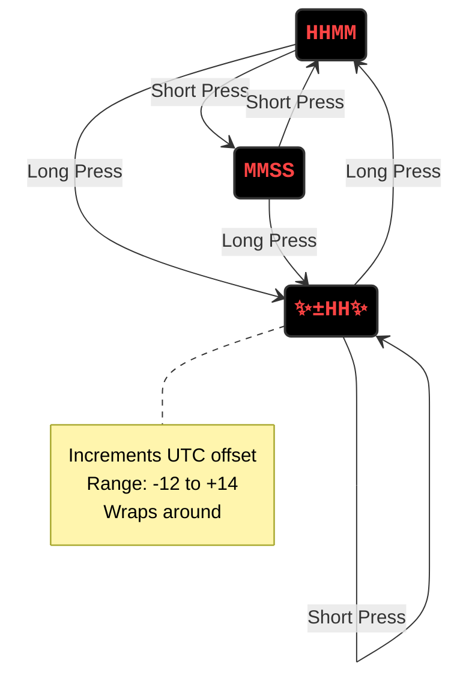

# Clock WiFi

[](https://www.rust-lang.org/) [](https://embassy.dev/)

A Rust-based embedded clock with WiFi time synchronization, controlled with `Embassy`.

## Configuration

WiFi credentials and starting timezone can be configured via environment variables or a `.env` file in the project directory (or `~/.pico.env`):

```bash
WIFI_SSID=your_network_name
WIFI_PASS=your_password
UTC_OFFSET_MINUTES=0  # e.g., -480 for PST (UTC-8)
```

The UTC offset can also be adjusted at runtime using the edit mode (see State Diagram below).

## Related Article

**[How Rust & Embassy Shine on Embedded Devices (Part 2): Insights for Everyone and Nine Rules for Embedded Programmers](https://medium.com/@carlmkadie/how-rust-embassy-shine-on-embedded-devices-part-2-aad1adfccf72)**  
by **Carl M. Kadie & Brad Gibson**, free on Medium.


## State Diagram



Note: ✨ indicates blinking.

### Display Modes

* `HHMM` - Hours and minutes (12-hour format)
* `MMSS` - Minutes and seconds

**Short Press**: Toggle between the two display modes.

**Long Press**: Enter UTC offset edit mode.

### UTC Offset Edit Mode (blinking)

<!-- markdownlint-disable MD038 -->
* ✨`±HH `✨ - Shows UTC offset (e.g., `+08 `, `-05 `, ` 00 `)

**Short Press**: Increment offset by 1 hour (wraps from +14 to -12).

**Long Press**: Return to `HHMM` mode with the new offset applied.

**Time Sync**: NTP time synchronization events are ignored while in edit mode.

## Wiring

See the [slides](https://slides.com/u007d/srug-2024-06#/6) from the June, 2024 Seattle Rust User Group meeting for the wiring diagram. Press the down arrow to the slide for each step. This design shows one resistor for each display digit. Alternatively, you can use one resistor for each segment for slightly more even
brightness.

## Tools & Debugging

This is project is setup to use `probe-rs`. The setup is based on
<https://github.com/U007D/blinky_probe/tree/main> from the
Embedded Rust Hardware Debug Probe workshop taught at the
Seattle Rust User Group in November 2024.

## License

Licensed under either:

* MIT license (see LICENSE-MIT file)
* Apache License, Version 2.0 (see LICENSE-APACHE file)
  at your option.
