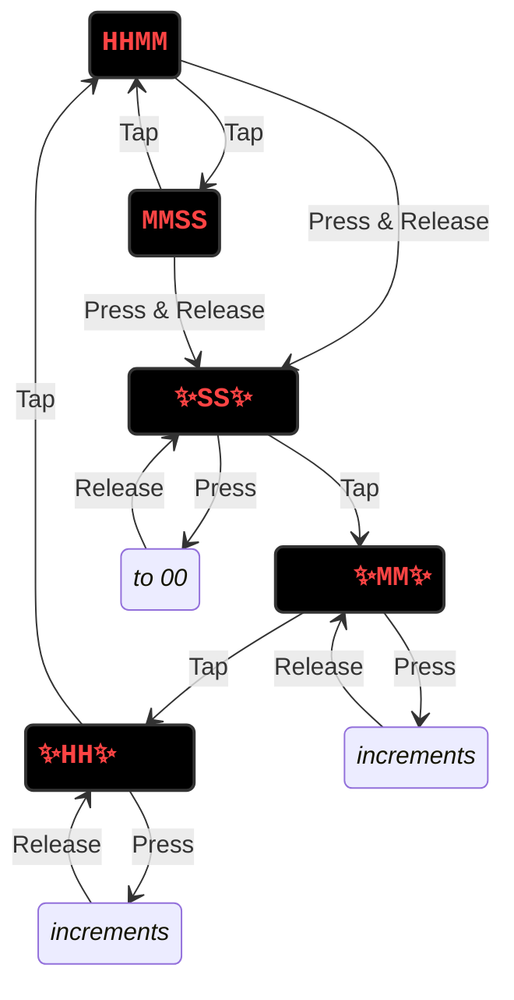

# Clock

 

A Rust-based embedded clock controlled with `Embassy`.

## Related Article

**[How Rust & Embassy Shine on Embedded Devices (Part 2): Insights for Everyone and Nine Rules for Embedded Programmers](https://medium.com/@carlmkadie/how-rust-embassy-shine-on-embedded-devices-part-2-aad1adfccf72)**  
by **Carl M. Kadie & Brad Gibson**, free on Medium.

## State Diagram

Note: ✨ indicates blinking.

### Display Modes

* `HHMM`
* `MMSS`

**Tap**: Switch between the two display modes.

**Press & Release**: Move to the edit modes.

### Edit Modes (blinking)

<!-- markdownlint-disable MD038 -->
* ✨` SS `✨
* ✨`  MM`✨
* ✨`HH  `✨

**Tap**: Move through the three edit modes and then return to the display modes.

**Press**: Change the value. Seconds go to `00`. Minutes and hours increment quickly.

**Release**: When the value is what you wish.

## Wiring

See the [slides](https://slides.com/u007d/srug-2024-06#/6) from the June, 2024 Seattle Rust User Group meeting for the wiring diagram. Press the down arrow to the slide for each step. This design shows one resistor for each display digit. Alternatively, you can use one resistor for each segment for slightly more even
brightness.

## Tools & Debugging

This is project is setup to use `probe-rs`. The setup is based on
<https://github.com/U007D/blinky_probe/tree/main> from the
Embedded Rust Hardware Debug Probe workshop taught at the
Seattle Rust User Group in November 2024.

## License

Licensed under either:

* MIT license (see LICENSE-MIT file)
* Apache License, Version 2.0 (see LICENSE-APACHE file)
  at your option.
